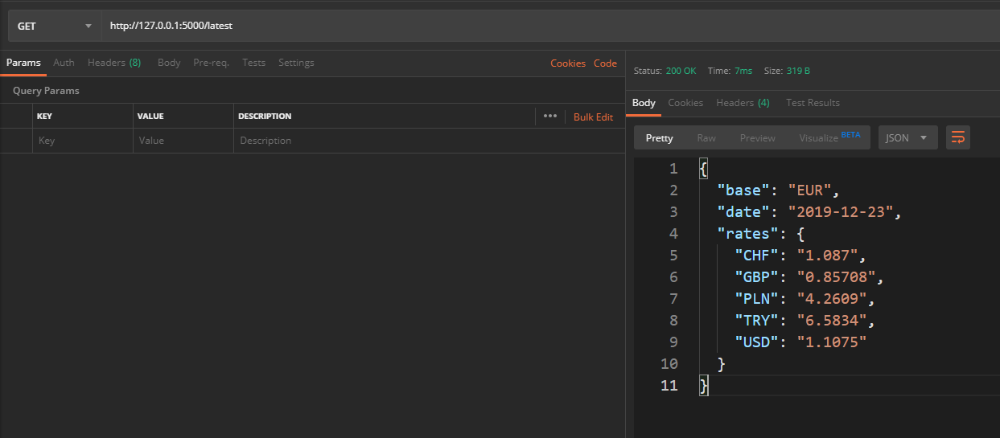

# REST API With Flask

Building an currency exchange REST API using Flask Framework written in Python.

## Installation

Make sure you have installed pipenv, that is a tool providing all necessary means to create a virtual environment for your Python project.

```bash
pip install pipenv
```
Activate virtual environment (on Windows):

```bash
pipenv shell
```

Install project dependencies:
```bash
pip install flask flask-sqlalchemy flask-marshmallow marshmallow-sqlalchemy
```

## Run server

```bash
python app.py
```

## Result



## Contributing
Pull requests are welcome. 

## License
[MIT](https://choosealicense.com/licenses/mit/)
